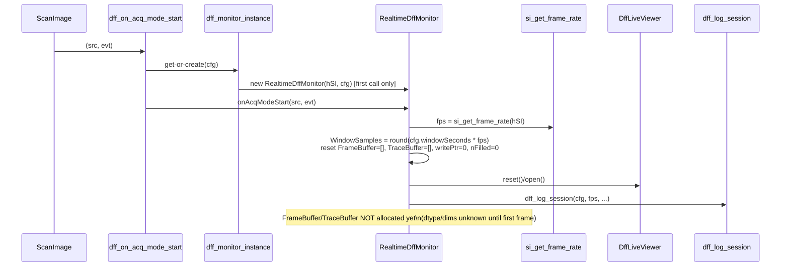

# Design: Real-Time df/f Monitoring via ScanImage User Functions

Status: **Architecture design**, produced via `/sc:design` from
`tasks/requirements_realtime_dff.md`. No implementation code yet.
Next step: `/sc:implement` (or `/sc:workflow`) — build under `dev/realtime_dff/` per CLAUDE.md §13,
promote to `proc/`/`gui/`/`io/`/`utils/` only after synthetic validation + user approval.

Traceability: FR/NFR/AC/OQ numbers below refer to `tasks/requirements_realtime_dff.md`.

## 1. Design Decisions Made This Phase

- **Registration**: programmatic, via a single `hSI.hUserFunctions`-registering init call
  (`dff_realtime_init`), not manual MDF/USR panel configuration. Resolves OQ5.
- **Cleanup events**: out of scope, per user decision — only `acqModeStart`/`frameAcquired` are
  hooked. Buffer/GPU memory is simply overwritten (not explicitly freed) on the next
  `acqModeStart`; no `acqModeDone`/`acqAbort` handlers. Resolves OQ2 (closed, not deferred).
- **dff_calc parameters**: a config struct (`cfg.dffParams`), defaulted to `dff_calc.m`'s own
  defaults, passed once at `dff_realtime_init` and logged. No live GUI editing in v1. Resolves OQ4.
- **GPU buffer dtype**: determined adaptively from the class of the first live frame returned by
  ScanImage (e.g. `int16`), not hardcoded. Resolves part of OQ6.
- **Trace extraction is incremental, not O(bufferSize) per frame**: FR4 requires the whole-FOV mean
  trace fed to `dff_calc` — but recomputing `mean(frameBuffer, [1 2])` over every buffered raw frame
  on *every* `frameAcquired` call is wasted GPU reduction work, since each frame's mean is
  independent of the others. Instead, a **parallel small circular buffer of per-frame scalar means**
  (`TraceBuffer`) is maintained alongside the raw-frame buffer: each new frame contributes exactly
  one new mean value in O(frame size), not O(bufferSize × frame size). `dff_calc` (per the earlier
  decision) still runs fresh over the *entire* ordered trace every call — this optimization only
  cheapens how that trace is produced, it doesn't change dff_calc's own recompute-every-frame
  behavior or its output.
- **State persistence pattern**: ScanImage calls named top-level functions, not object methods, and
  doesn't hand back a durable handle between calls. State (buffer, GUI handle, params) is held in a
  singleton `RealtimeDffMonitor` handle-class instance, reached from the two thin SI-registered
  callback functions via a `persistent`-variable accessor. This keeps ScanImage-facing code trivial
  and testable logic in a plain class.
- **Unverified ScanImage internals are isolated behind an adapter layer** (`io/si_*.m`): frame
  access, frame-rate access, and registration are the three places this design depends on ScanImage
  API details that were not confirmed against a live install (OQ1, OQ3, and the registration API
  itself). Bundling them into three small functions means the mandatory verification spike (see §6)
  touches only those three files, not the rest of the architecture.

## 2. Component Diagram

```mermaid
graph TD
    SI[ScanImage Core] -->|acqModeStart event| CB1[dff_on_acq_mode_start.m]
    SI -->|frameAcquired event| CB2[dff_on_frame_acquired.m]
    INIT[dff_realtime_init.m] -->|constructs + registers| SI
    INIT -->|creates| MON

    CB1 -->|dispatch via| ACC[dff_monitor_instance.m<br/>persistent singleton accessor]
    CB2 -->|dispatch via| ACC
    ACC --> MON[RealtimeDffMonitor<br/>proc/]

    MON -->|si_get_last_frame| ADP1[io/si_get_last_frame.m]
    MON -->|si_get_frame_rate| ADP2[io/si_get_frame_rate.m]
    INIT -->|si_register_user_functions| ADP3[io/si_register_user_functions.m]
    ADP1 & ADP2 & ADP3 -.unverified API surface.-> SI

    MON -->|ordered trace| DFF[dff_calc.m<br/>Session_analysis/app/Proc<br/>unmodified]
    MON -->|update(t, dff)| GUI[DffLiveViewer<br/>gui/]
    MON -->|session params| LOG[io/dff_log_session.m]
    MON -->|defaults| PARAMS[utils/dff_default_params.m]
```

## 3. Sequence: acqModeStart



## 4. Sequence: frameAcquired

```mermaid
sequenceDiagram
    participant SI as ScanImage
    participant CB2 as dff_on_frame_acquired
    participant ACC as dff_monitor_instance
    participant MON as RealtimeDffMonitor
    participant ADP1 as si_get_last_frame
    participant DFF as dff_calc.m
    participant GUI as DffLiveViewer

    SI->>CB2: (src, evt)
    CB2->>ACC: get(existing)
    CB2->>MON: onFrameAcquired(src, evt)
    MON->>ADP1: frame = si_get_last_frame(hSI, cfg.channelIdx)
    alt first frame this session
        MON->>MON: allocate FrameBuffer gpuArray [H,W,WindowSamples] as class(frame)<br/>allocate TraceBuffer gpuArray [WindowSamples,1]
    end
    MON->>MON: FrameBuffer(:,:,writePtr+1) = gpuArray(frame)<br/>TraceBuffer(writePtr+1) = mean(frame(:))  % O(frame size) only
    MON->>MON: writePtr = mod(writePtr+1, WindowSamples); nFilled = min(nFilled+1, WindowSamples)
    MON->>MON: trace = ordered(TraceBuffer, writePtr, nFilled)  % handles circular unwrap
    MON->>DFF: dff = dff_calc(trace, fps, tau_0, tau_1, tau_2, invert)
    MON->>GUI: update(trace_time, dff)
```

## 5. Module / File Breakdown

Developed under `dev/realtime_dff/` (flat) first; target column is the post-promotion location.

| File | Target dir | Responsibility |
|---|---|---|
| `RealtimeDffMonitor.m` | `proc/` | Handle class: owns buffers, orchestrates extraction + dff_calc + GUI update per event |
| `DffLiveViewer.m` | `gui/` | Handle class: owns the standalone figure/axes; `update(t, dff)`, `reset()` |
| `si_get_last_frame.m` | `io/` | Adapter: returns latest frame for a channel index. **Unverified — spike required** |
| `si_get_frame_rate.m` | `io/` | Adapter: returns live frame rate (Hz). **Unverified — spike required** |
| `si_register_user_functions.m` | `io/` | Adapter: registers callbacks against `hSI.hUserFunctions`. **Unverified — spike required** |
| `dff_log_session.m` | `io/` | Writes one reproducibility log record per acqModeStart (NFR3) |
| `dff_monitor_instance.m` | `utils/` | `persistent`-variable singleton get/create/clear accessor |
| `dff_default_params.m` | `utils/` | Returns default `cfg` struct mirroring `dff_calc.m`'s own defaults |
| `dff_realtime_init.m` | `proc/` | Public entry point: user calls once per SI session to construct + register everything |
| `dff_on_acq_mode_start.m` | `proc/` | Thin SI-facing callback → `dff_monitor_instance` → `onAcqModeStart` |
| `dff_on_frame_acquired.m` | `proc/` | Thin SI-facing callback → `dff_monitor_instance` → `onFrameAcquired` |

## 6. Interface Definitions (signatures only — no implementation)

```matlab
% --- proc/RealtimeDffMonitor.m ---
classdef RealtimeDffMonitor < handle
    properties
        hSI              % ScanImage model reference (not owned)
        ChannelIdx       % functional channel index
        WindowSeconds    % configured buffer time window
        Fps              % resolved at acqModeStart
        WindowSamples    % round(WindowSeconds * Fps)
        DffParams        % struct: tau_0, tau_1, tau_2, invert
        FrameBuffer      % gpuArray [H, W, WindowSamples], class matches live frame; [] until first frame
        TraceBuffer      % gpuArray [WindowSamples, 1] double; per-frame whole-FOV means
        WritePtr         % circular write index, 0-based before mod
        NFilled          % samples written so far, capped at WindowSamples
        Viewer           % DffLiveViewer instance
    end
    methods
        function obj = RealtimeDffMonitor(hSI, cfg)               % construct from a resolved cfg struct
        function onAcqModeStart(obj, src, evt)                     % FR1, FR2
        function onFrameAcquired(obj, src, evt)                    % FR3, FR4
    end
end

% --- gui/DffLiveViewer.m ---
classdef DffLiveViewer < handle
    methods
        function obj = DffLiveViewer()
        function reset(obj)                                        % FR2: clear/open dedicated window
        function update(obj, tSec, dffTrace)                       % FR4: refresh live plot
    end
end

% --- io/si_get_last_frame.m ---
function frame = si_get_last_frame(hSI, channelIdx)
    % Returns the most recently acquired frame for channelIdx.
    % UNVERIFIED: body must confirm src.hSI.hDisplay.lastFrame{channelIdx} against a live session (OQ1).

% --- io/si_get_frame_rate.m ---
function fps = si_get_frame_rate(hSI)
    % Returns the live scan frame rate in Hz.
    % UNVERIFIED: candidate hSI.hRoiManager.scanFrameRate must be confirmed against a live session (OQ3).

% --- io/si_register_user_functions.m ---
function si_register_user_functions(hSI, eventFcnMap)
    % eventFcnMap: struct mapping event name -> function name string, e.g.
    %   struct('acqModeStart','dff_on_acq_mode_start','frameAcquired','dff_on_frame_acquired')
    % UNVERIFIED: exact hSI.hUserFunctions registration API must be confirmed against a live session.

% --- io/dff_log_session.m ---
function dff_log_session(cfg, resolvedFps, logDir)
    % Writes one timestamped record: cfg (channelIdx, windowSeconds, dffParams),
    % resolvedFps, MATLAB version, GPU device name. Per CLAUDE.md §3 reproducibility.

% --- utils/dff_monitor_instance.m ---
function obj = dff_monitor_instance(action, varargin)
    % action: 'get' (returns [] if none), 'create' (varargin = {hSI, cfg}), 'clear'
    % persistent monitorObj inside; single point of truth for the live singleton.

% --- utils/dff_default_params.m ---
function cfg = dff_default_params()
    % Returns struct('channelIdx',1,'windowSeconds',20,
    %                 'dffParams',struct('tau_0',0.1,'tau_1',0.35,'tau_2',2.0,'invert',false))
    % tau/invert defaults intentionally mirror dff_calc.m's own nargin<N defaults (single source of truth risk — see §8).

% --- proc/dff_realtime_init.m ---
function dff_realtime_init(hSI, cfgOverrides)
    % Public entry point. Merges cfgOverrides onto dff_default_params(),
    % constructs RealtimeDffMonitor via dff_monitor_instance('create', hSI, cfg),
    % calls si_register_user_functions(hSI, ...). Called once per SI session by the user.

% --- proc/dff_on_acq_mode_start.m ---
function dff_on_acq_mode_start(src, evt, varargin)
    % mon = dff_monitor_instance('get'); mon.onAcqModeStart(src, evt);

% --- proc/dff_on_frame_acquired.m ---
function dff_on_frame_acquired(src, evt, varargin)
    % mon = dff_monitor_instance('get'); mon.onFrameAcquired(src, evt);
```

## 7. Circular Buffer Ordering Detail

`TraceBuffer` is written at `WritePtr+1` each call (1-indexed), `WritePtr` advances mod
`WindowSamples`. To hand `dff_calc` a chronologically ordered (oldest→newest) trace once the buffer
has wrapped:

- If `NFilled < WindowSamples` (buffer not yet full): `trace = TraceBuffer(1:NFilled)` — no
  reordering needed, since filling always starts at index 1.
- Once full and wrapping: `trace = [TraceBuffer(WritePtr+1:end); TraceBuffer(1:WritePtr)]`.

This reorder is an O(WindowSamples) scalar copy (e.g. ~600 elements) — trivial next to the O(frame
size) work done per call, and independent of `FrameBuffer`'s (much larger) raw pixel data.

## 8. Risks Carried Into Implementation

1. **Three unverified ScanImage API calls** (§6, `io/si_*.m`) — first implementation task must be an
   interactive spike against a live ScanImage session (`disp(hSI.hDisplay)`,
   `disp(hSI.hRoiManager)`, `disp(hSI.hUserFunctions)`) to confirm each, per requirements doc OQ1/
   OQ3 and the registration API. Nothing downstream should be trusted until this spike passes.
2. **`dff_default_params.m` duplicates `dff_calc.m`'s defaults** rather than introspecting them —
   if `dff_calc.m`'s defaults ever change, these two files can silently drift. Acceptable for v1
   given `dff_calc.m` is treated as stable trusted infrastructure (CLAUDE.md §9), but worth a
   comment cross-referencing the two files.
3. **No cleanup handlers** (per user decision in §1) means GPU memory from `FrameBuffer` persists
   between acquisitions until the next `acqModeStart` overwrites it, and an aborted acquisition
   leaves the plot showing a partial/stale trace until the next run starts. Accepted tradeoff, not
   a defect — flagging so it isn't rediscovered as a "bug" later.
4. **Frame dimensions/dtype unknown until first `frameAcquired`** means `FrameBuffer` allocation
   happens inside the first `frameAcquired` call rather than at `acqModeStart` — that first call
   will be slightly slower (GPU allocation) than steady-state calls. Should be measured during
   synthetic validation (CLAUDE.md §8) to confirm it doesn't visibly stall the first frame.

## 9. Out of Scope (confirmed)

- Per-ROI extraction (whole-FOV only, per requirements §3)
- `acqModeDone`/`acqAbort` cleanup handlers (per user decision, §1)
- Live GUI editing of dff parameters
- GPU-availability fallback/preflight check
- Streaming/incremental reimplementation of `dff_calc`'s internal math (recompute-per-frame over
  the full trace window is the chosen strategy, per requirements §3)
